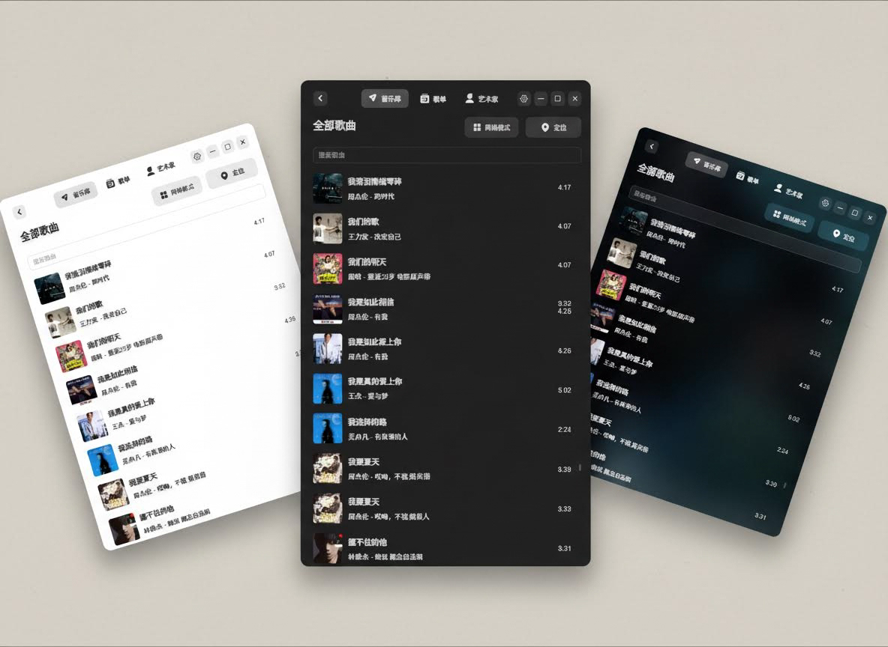
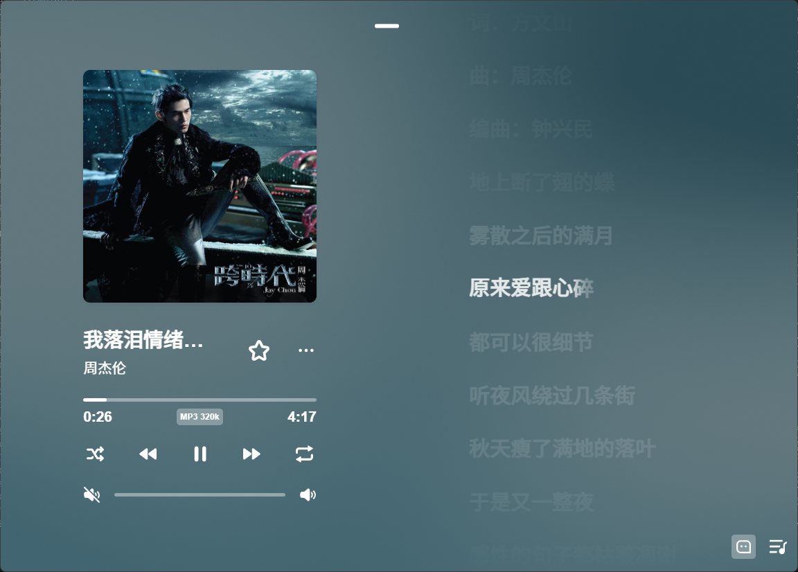

# 依音（Yiyin Music）

<p align="center">
  
</p>

<p align="center">
  
  
  
</p>

> **依音（Yiyin Music）** —— 专注本地音乐的跨平台播放器  
> 无广告、无评论、无推荐算法干扰  
> 基于 **Electron + Vue 3 + TypeScript** 构建

## ⭐ 如果这个项目对你有帮助，欢迎 Star 支持一下，这是对作者最大的鼓励！

## 📸 应用截图

<p align="center">
  <b>依音播放器</b><br><br>
  
  <br><br>
  
</p>

<p align="center">
  <b>远程控制 · 明亮模式</b><br><br>
  
</p>

<p align="center">
  <b>远程控制 · 深色模式</b><br><br>
  
</p>

---

## 产品理念

- 专注本地音乐，不接入在线音乐平台
- 无广告 / 无评论 / 无推荐算法干扰
- 完整读取音乐文件的标签信息（ID3 / FLAC / APE 等）
- 支持局域网远程控制，通过扫码控制播放器
- 界面简洁，回归音乐本身

---

## 技术栈

- **Electron** — 跨平台桌面应用框架
- **Vue 3** — 组合式 API
- **TypeScript** — 强类型支持
- **Element Plus** — UI 组件库
- **Vite** — 极速构建工具
- **WebSocket / QRCode** — 局域网远程控制支持

---

## 功能特点

| 功能模块     | 说明                                                                                     |
| ------------ | ---------------------------------------------------------------------------------------- |
| 本地音乐扫描 | 扫描并导入本地音乐文件夹                                                                 |
| 标签信息读取 | 读取歌曲标题、歌手、专辑、封面、年份等                                                   |
| 歌词显示     | 可使用 LDDC 或 musictag 软件将歌词写入音乐文件标签（MP3 / FLAC / APE 等），无需 LRC 文件 |
| 歌手视图     | 按歌手自动归类浏览                                                                       |
| 专辑视图     | 基于标签信息生成专辑列表                                                                 |
| 歌单管理     | 创建 / 编辑 / 删除自定义歌单                                                             |
| 收藏系统     | 收藏喜欢的歌曲，快速访问                                                                 |
| 播放控制     | 播放 / 暂停 / 上一首 / 下一首                                                            |
| 界面模式     | 明亮 / 深色 / 沉浸                                                                       |
| 远程控制     | 局域网扫码即可控制播放器（播放、切歌等）                                                 |
| 跨平台支持   | Windows / macOS                                                                          |

---

## 远程控制使用指南

1. 确保播放器和手机/其他设备在同一局域网内。
2. 打开播放器，进入“远程控制”页面，会显示二维码。
3. 使用手机扫描二维码，即可连接到播放器。
4. 连接成功后，可以远程执行：
   - 播放 / 暂停
   - 上一首 / 下一首

> 局域网远程控制无需注册账号，完全本地运行。

---

## 安装与运行

### 克隆项目

```bash
git clone https://github.com/yourname/yiyin-music.git
cd yiyin-music
```

## 安装依赖

使用你喜欢的包管理工具：

```bash
# 使用 npm
npm install

# 或使用 pnpm
pnpm install
```

## 开发运行

```bash
# 使用 npm
npm run dev

# 或使用 pnpm
pnpm run dev
```

## 构建打包

```bash
Windows
npm run build:win

macOS
npm run build:mac

Linux
npm run build:linux

打包完成后可在 dist/ 目录找到对应平台的安装包。
```

## 致谢

- 歌词显示组件库感谢：  
  https://github.com/amll-dev/applemusic-like-lyrics  
  本项目的歌词显示功能直接使用了该组件库实现。

- 如果需要歌词资源与逐字歌词工具，可使用：  
  https://github.com/chenmozhijin/LDDC  
  可用于获取并生成逐字歌词。

- 歌词获取方式：可以使用 [LDDC](https://github.com/chenmozhijin/LDDC) 或 musictag 等软件，将歌词写入音乐文件标签（ID3 / FLAC / APE），播放器会直接读取标签中的歌词，无需 LRC 文件。

## License

```bash
MIT License
© 2026 依音（Yiyin Music）
```

## License

MIT License


## 免责声明

- 本软件完全免费，供本地音乐播放使用。
- 软件不提供任何在线音乐资源，所有音乐文件需用户自行获取。
- 用户需确保音乐文件的使用符合相关法律法规。
- 作者不对因使用本软件而产生的版权或法律问题承担责任。
- 目前作者比较忙，可能无法及时处理 bug、优化或添加新功能，请理解。
